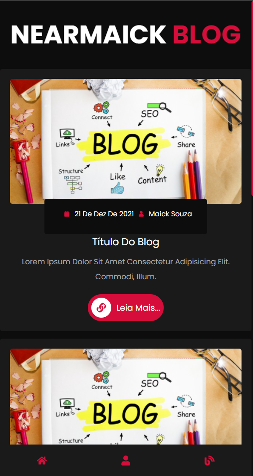
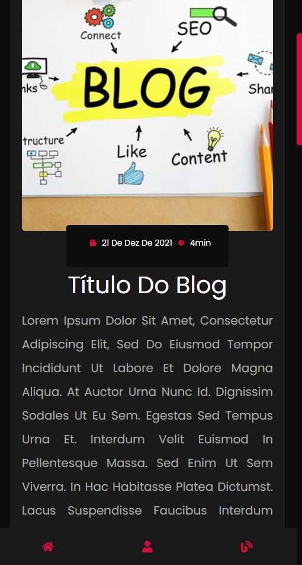

#NEARMAICK BLOG

##Um dos primeiros projetos oficial do oficial publicado na web

###Utilizei Next.JS com SASS para implementar as páginas, sendo hostedada pela vercel

####imagens:

###Para rodar localmente, faça um git clone do projeto e...

yarn

para instalar as dependências, depois rode...

yarn dev

e acesse http://localhost:3000 para visualizar a página no seu navegador...
